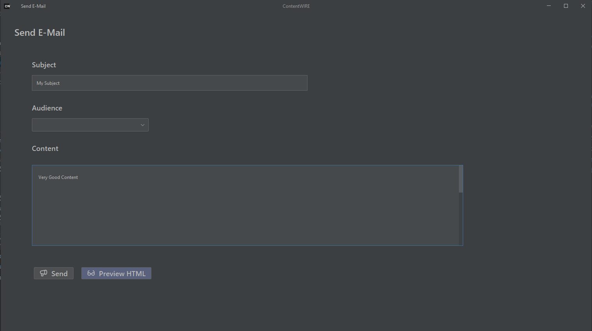

# ContentWIRE Felhasználói Útmutató

A **ContentWIRE** *E-Mail Marketing automatizációs alkalmazás* könnyen kezelhető megoldásokat nyújt kis-, illetve középvállalkozások számára a reklámkampányaik kezelésére, valamint azoknak egyszerűen menedzselhető skálázására.

# Alapvető Működési Elvek

A ContentWIRE egy asztali alkalmazás, melynek jellemzői és funkcionalitása szervezetenként személyreszabottan inicializálhatóak. A rendszer adatainak perzisztenciáját minden esetben egy **elöljáróban létrehozott relációs adatbáziskezelő rendszer** biztosítja, amely szükségszerűen rendelkezik Java programnyelvhez illeszkedő driverekkel. A rendszer **két típusú felhasználót** különböztet meg egymástól, ezek a *Campaign Orchestrator* és a *Campaign Responsible*. Míg előbbiek a szervezet tagjainak, kampányainak, közönségeinek, valamint a közönségek tagjainak kezeléséért felelnek, utóbbiak a tényleges E-Mail marketing feladatokat látják el. Minden felhasználót egyértelműen azonosít a felhasználóneve, **a bejelentkezés** pedig **felhasználónév-jelszó alapú autentikációval** történik. Minden rendszerben létezik egy *root* Campaign Orchestrator, akit nem távolíthatunk el a rendszerből.

## Az E-Mail Marketing Workflow Építőkövei

Az E-Mail Marketinges feladatok ellátásában az E-Mailek küldése, valamint a közönségek menedzselése több, különböző tulajdonságokkal rendelkező részbe tömörül. **A közönség tagjai közönségekbe csoportosulnak**. Ezen csoportosulások azonban nem kizáró jellegűek, így egy tag több közönségben is szerepelhet egyazon időben. A közönségeket az előbbihez hasonló módon kampányokba szervezhetjük, a kampányokhoz pedig több Campaign Responsible-t is rendelhetünk, ekkor ezen felhasználóknak lehetősége nyílik a kampány bármelyik közönségének levelet küldeni.

### Campaign

Egy üzleti-/reklámcélt szolgáló csoport, melynek tagjai közönségek. A csoport életciklusa és erőforrásai általánosságban limitáltak.

### Audience

Azonos, vagy hasonló attribútumok alapján gyűjtött, illetve rendezett közönségtagok csoportja, tagjai a kommunikáció elemi végpontjait határozzák meg.

### Audience Member

Valós személyek, vagy entitások, közönségekbe tömörülnek, többek között a nevük és E-Mail címük jellemzi őket.

#### Példa

Gipsz Jakab és Gipsz Jenő tagjai a *Veszprém megyei lakosok* c. közönségnek, Gipsz Jenő egyúttal a *Nyugat-Magyarországi Informatikusok* közönség tagja is. Az imént említett közönségek a *Nyugat-Magyarország Kibervédelmi Tudatosítása* kampány részei, mely kampányt Dr. Szalacsi Sándor kommunikációs asszisztens kezeli. Szalacsi más kampányokat is vezérel, valamint a kiberbiztonsági kampány feladatainak ellátásban akadnak segítői is.

# Autentikáció

A ContentWIRE alkalmazás használatakor az első lépés az autentikáció. A felhasználók előre elkészített profilokkal (felhasználónévvel, ill. jelszóval) jelentkezhetnek be a rendszerbe, melyeknek paramétereit a Kampányszervezők állítják be. Az alkalmazás indítása után felhasználói interfészen keresztül adhatjuk meg a bejelentkezési adatainkat.

# Kampányszervezés
A bejelentkezés után a kampányszervezők a következő felhasználói felületet láthatják maguk előtt:

A bejelentkezést követően a következő oldalakra léphetünk:

1. Manage Campaigns
2. Manage Audiences
3. Manage Audience Members
4. Manage Organization Members

## Manage-fülek
A menüsorban, valamint a főoldalon látható opciókra kattintva kezelhetjük a már felsorolt szervezeti entitásokat, ezek közül csak a kampányok kezelését szemléltetjük, hiszen a többi entitást is ezzel analóg módon tudjuk manipulálni.

A *Campaigns*-fülön láthatjuk a szervezet aktív kampányait, pontosabban ezek neveit és leírását. **Hozzáadhatunk** új kampányt, ezesetben egy Modal-ablakban gépelhetjük be az adatokat, de akár **törölhetünk** is kijelölt elemet. Egy kampányra kattintva **megjeleníthetjük a** hozzárendelt, illetve hozzá nem rendelt **közönségeket**, ezeknek **a kampánnyal alkotott viszonyát tetszés szerint módosíthatjuk**.

# Kampánykezelés
A kampányfelelősök a hozzájuk rendelt közönségeknek írhatnak, illetve küldhetnek E-Maileket. Egyszerre csupán egy közönségnek tudunk E-Mailt küldeni, hiszen feltételezzük, hogy  a közönségek egyező, vagy hasonló attribútumok alapján szervezettek.

A küldés gombra kattintva a kampányfelelősnek meg kell adnia az SMTP szolgáltatójához tartozó adatokat, ezek elengedhetetlenek a levelek küldéséhez.

## HTML Levelek
Mivel az üzeneteket alapból is MIME-formátumban küldjük a címzettnek, a felhasználó megadhat HTML szöveget is a levél tartalmaként, ezt a 'Preview HTML' gombra kattintva az alapértelmezett böngészőben meg is tudjuk jeleníteni.

